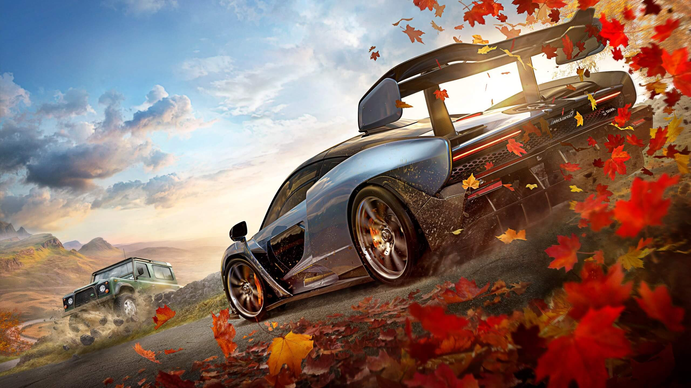
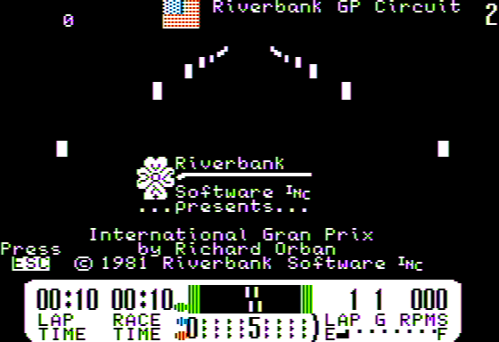
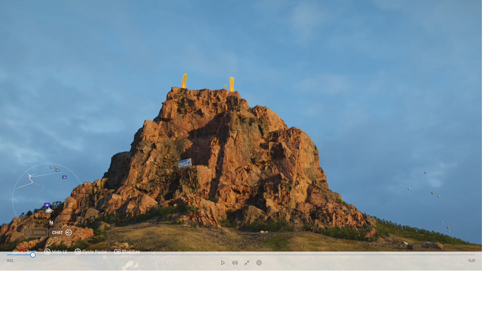
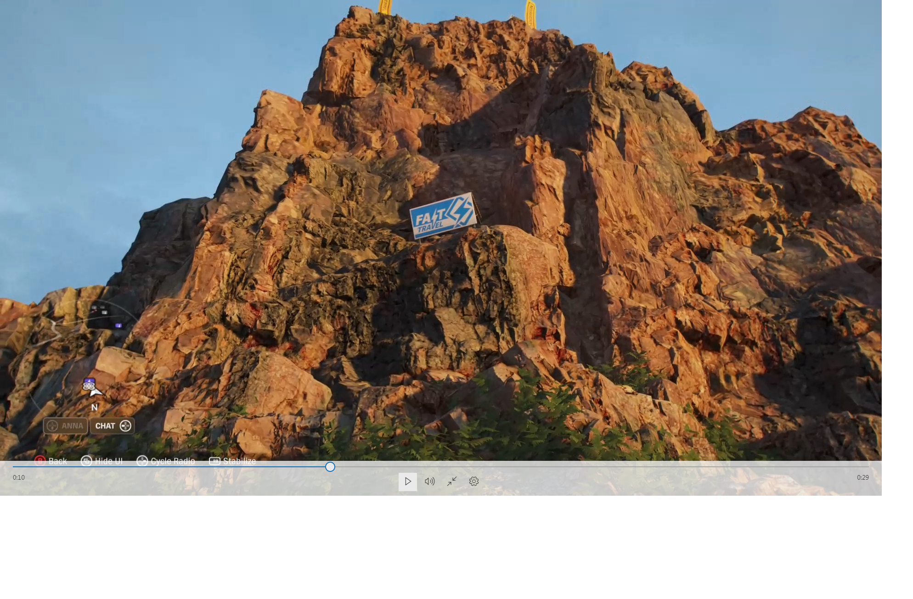
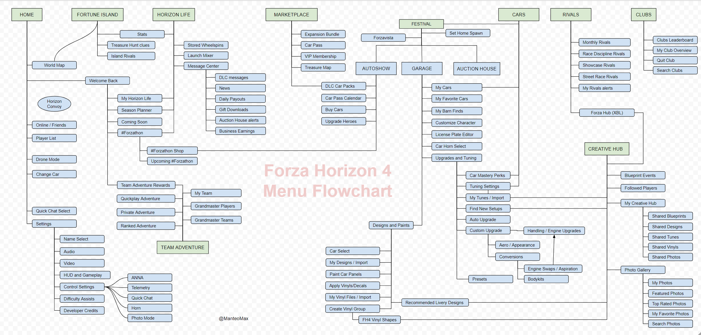

Forza Horizon 4 -- First Impressions

# OMG !!!

Normally cover art doesn't do the game justice:

* 

But from the moment you boot up the game, see the cover art, and are introduced to the kick-ass [loading screen](https://www.youtube.com/watch?v=GYeADDB0Rt8) and music:

Ho Le Fuk!

Forza Horizons 4 is freaking B-E-A-utiful and sounds great!!!

Check out the seamless transistion as the weather changes on the loading screen! Even the wiper blades are in tune with the music. LOL.

# Background

I've always been into racing games with an on-again off-again affair -- due to lack of time with playing a ton of OTHER genres. Here are the racing games I grew up with:

* International Grand Prix on ye old Apple 2
  * 
* AutoBahn
* Need For Speed PS1 -- well I worked on it ;-)
* NFS 2
* NFS Porsche Unleashed
* NFS:Most Wanted
* Test Drive 1
* Test Drive 2
* Daytona USA -- arcade set the GOLD standard of 60 fps for YEARS!
* Test Drive 3 -- I "kracked" this back in the day
* Stunts -- track editor. Enough said!
* Gran Turismo 3 -- a TON of it with my Logitech racing wheel on the PS2)
* Project Gotham Racing -- power slides was never so much fun!
* Gran Turismo Sport -- a LOT of it with my Logitech G29 racing wheel on the PS4

# So what makes FH4 so special?

Now I've never played a Forza game before so Forza Horizon 4 is my first introduction to the world of Forza.

Compared to GTS (Gran Turismo Sport) these are the things I've having an absolute blast with:

* amazing detailed graphics -- reflection quality, shadow quality, liveries.
* open world to explore
* **dynamic** day-night cycle
* **seasonal weather**
* deep upgrade system akin to GT3
* deep tuning
* better music
* Ability to change the difficulty on the fly
* jumps
* mix of racing, drifting, drag, and dirt racing -- when you get tired/bored of one you can mix it up

# Cut-scenes

The *seamless* transition of cut-scenes to gameplay is amazing. THIS is how you do cut-scenes!!  Sadly, you can't skip them.

I think part of this is due to the high fidelity -- extremely high polygon count and great textures / shaders.

# Graphics

Holy sheep -- look at the **draw distance** on this puppy!

TODO: day picturee

Here is the same scene during the night.

TODO: night picture

You can see the indivual lights!

YES! They have **dynamic** real-time day-night cycles.

It looks like they are using dynamic tesselation for the environment.

* [Video](https://1drv.ms/v/s!AtFP4KSoBihjd6dxd2_0qyZwwLk)

* 
* 

The level of fidelity is amazing.  You can even see INTO the apartments.

TODO: apt picture

# Gameplay

In a shared open world the first question people probably ask is:

Q. _How does the game handle griefers?_

A. **It ghosts them out!**

They can't wreck your fun!  THAT's the perfect response to how you handle strangers: Make them cosmetic.

## World Events

Guild Wars 2 helped popularized **dynamic world events.**  FH4 has "Forzathon" events that start on the hour every hour.  You have 3 tasks you try to complete.  Each stage gives you 20 Forzathon Points.

FH4 puts the FUN in racing:

* Race against a hovercraft!
* Participate in _The Halo Experience._

## Dynamic Seasons

Once you complete the tutorial you are thrown into "Weekly Season".

# Loot-boxes, no, not THAT  kind.

Unfortuntely the word "loot boxes" has become a dirty word due to publisher's greed.

There are TWO kinds of loot-boxes:

* In-game
* Pay-to-win

Like Vermintide 2, FH4 has **in-game loot boxes** in the form of [Wheelspin](https://forza.fandom.com/wiki/Horizon_Wheelspin) -- a in-game slot machine with a spinning prize reel.  As you play the game you level up and get free wheelspins so it doesn't "cost" anything except time.   Technically you can also buy them with FP, "Forza Points", but the only way to get FP is to take place in Forzathon events (and win.)

Wheelspins are one of the fastest ways to make money.  It is how I was able to get a McLaren Senna on day 1. :-)

It looks like Wheelspins are the ONLY way to earn cosmetics for character customization.

I have no opinion on whether wheelspins are good or bad.

# Simulation

Is FH4 a hard-core simulation? No, it is an arcade game.

The problem with "fun" is that it varies from person to person.

* Some people find hard-core realism fun
* Some people want a balance of realism
* some people want causal arcade

FH4 like NFS takes the middle-of-the-road approach.

That's not to say it can't be challenging.  You can control:

* Traction
* ABS

# Drifting

I've been wanting to get into drifing but could never get the "hang" of it due to lack of time.

I finally found THE perfect spot to practise drifting -- on the beach!

TODO: picture of beach

#   Wheel vs Controller

The game feels GREAT with a controller.

However the Xbox controller itself feels like cheap shit.  I'm using mine wired so it doesn't have the "hefty" feel to it -- but that seems like a cop-out excuse.  Still, I'm curios so I'll try that out sometime.

# Music

I'm used to the electronic rock / electro house / jazz [music of GT3](https://en.wikipedia.org/wiki/Music_of_the_Gran_Turismo_series#Gran_Turismo_3) so I wasn't sure what to expect with FH4.

From the moment the loading screen kicks in the FH4's music sounds *good*.  It has the _perfect_ vibe that conveys **FUN**.

# Sounds

Car sounds in FH4 for some reason sound quiet -- almost muffled.  For example the Dodge Viper sounds "wimpy".  I managed to go into a tunnel and got the DEEP roar sound that I was expecting.

It sounds like they are using dynamic environment audio. That's pretty cool!  Just wish the engine sounds sounded "meater".

# Problems

So is FH4 perfect? Ha! No.

* UI is still a clusterfuck.

  * 

* You can't skip the company logo movies.  **sigh**  Do I **really** need to see this shit EVERY FUCKING TIME I boot the game???

* Going through the single player tutorial had TONS of options on the map.  However as you progress the seasons automatically change and you CAN'T do those events -- or so I thought.  The game does **not communicate** with you that they WILL be available once you complete the tutorial.

* The replay system **sucks:**

  * You can't save a replay -- you can only export the video from the Xbox dashboard. Really???
  * How do I see the telemetry data -- gas? brake? wheel?  This is one thing GTS **nailed**
  * How do I take a screenshot RIGHT as I cross the finish line? You CAN'T because you automatically get kicked out of the replay system.
  * Skip forward/backward wasn't working for me. WTF?

* Restarting a mission reset the radio station. Extremely annoying. As a temporary work-around I turned the radio OFF. 

* [x] Wheel support at [launch](https://forums.forzamotorsport.net/turn10_postst132935p2_-ANSWERED---XBOX--FH4-Unplayable-with-Logitech-G920-Wheel.aspx?=) was broken.  Thankfully that is fixed now. (Annnd this is why you don't buy games on day 1 -- you always wait a few months for the bugs to get fixed.)

# GTS vs FH4

How is this a "fair" comparison when they are different genres?

Shouldn't I be comparing GTS to Forza Motosports 7?

It is the **contrast** of the different games that I want to focus on.

First off, both are "arcade" / "simcade" racing games.

Second, the focus of the games are different.  There are no real good "open world" driving games on the PS4. No, the Crew 2 doesn't count. See [The Crew 2 Review: Buy, Sale, Rent, Skip](https://www.youtube.com/watch?v=C8u4ihut2Ec) review.

# Bottom Line:

I think there is one word that summarizes FH4.

**FUN**

Isn't that what games are supposed to be about? :-)

GTS in comparison seems "clinical".  That's not to say it isn't fun -- it is -- but the _focus_ in GTS is more about Precision. A heritage from the Japanese developer culture.  FH4 is more like an American -- more concerned about looking good and having fun.  I am NOT imply that FH4 focus on Form over Function -- it think it strikes a good balance between the two.

Alright, that's enough raving and ranting. To borrow a catch phrase from [The Critical Drinker](https://www.youtube.com/channel/UCSJPFQdZwrOutnmSFYtbstA)

_"Go away now"_

